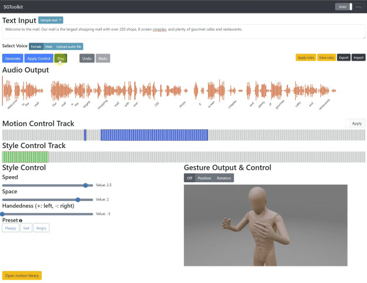

# SGToolkit

This is the code for SGToolkit: An Interactive Gesture Authoring Toolkit for Embodied Conversational Agents (UIST'21). 
We introduce a new gesture generation toolkit, named SGToolkit, which gives a higher quality output than automatic methods and is efficient than manual authoring. 
For the toolkit, we propose a neural generative model that synthesizes gestures from speech and accommodates fine-level pose controls and coarse-level style controls from users.



### [ACM DL](https://doi.org/10.1145/3472749.3474789) | [arXiv](https://arxiv.org/pdf/2108.04636.pdf) | [Presentation video](https://youtu.be/qClSOtLiVlc)
(please visit the ACM DL page for the supplementary video)

## Install

(This code is tested on Ubuntu 18.04 and Python 3.6)

* Install gentle and put the path into PYTHONPATH
    ```bash
    git clone https://github.com/lowerquality/gentle.git
    cd gentle
    ./install.sh  # try 'sudo ./install.sh' if you encounter permission errors
    ```

* Setup Google Cloud TTS. Please follow [the manual](https://cloud.google.com/docs/authentication/getting-started) and put your key file (`google-key.json`) to `sg_core` folder.

* Install Python packages
    ```bash
    pip install -r requirements.txt 
    ```

* Download the model file ([dropbox](https://www.dropbox.com/s/b5rwtn60j4tf2vr/multimodal_context_checkpoint_best.bin?dl=0)) and put it into `sg_core/output/sgtoolkit` folder


## Quickstart

You can run the SGToolkit in your PC with the pretrained model. Run the Flask server `python waitress_server.py` and connect to `localhost:8080` in a web browser supporting HTML5 such as Chrome and Edge.

Input speech text in the edit box or select example speech text, 
and then click the `generate` button to synthesize initial gestures and click the `play` button to review the synthesized gestures.
You now can add pose and style controls. Select a desired frame in the pose or style tracks and add pose controls by editing mannequin or style controls by adjusting style values.
Press `apply controls` to get the updated results. 

Note that the motion library and rule functions are not available. If you want to use them, please setup MongoDB and put the db address at `app.py` line 18.  


## Training

1. Download the preprocessed TED dataset ([OneDrive link](https://kaistackr-my.sharepoint.com/:u:/g/personal/zeroyy_kaist_ac_kr/EWwpDefvifdCvVKkExlv12QBoRdjiyqy9BXnLGMzFD-HeQ?e=WPUtgo)) and extract to `sg_core/data/ted_dataset_2020.07`

2. Run the train script
   ```bash
   cd sg_core/scripts
   python train.py --config=../config/multimodal_context_toolkit.yml
   ```


## Animation rendering

1. Export current animation to json and audio files by clicking the export button in the upper right corner of the SGToolkit, and put the exported files into a temporary folder.
2. Open `blender/animation_uist2021.blend` file with Blender 2.8+.   
3. Modify `data_path` at line 35 of `render` script to be the temporary path containing exported files, and run the script `render` 


## Related repositories

* TED DB: https://github.com/youngwoo-yoon/youtube-gesture-dataset 
* Base model: https://github.com/ai4r/Gesture-Generation-from-Trimodal-Context
* HEMVIP, the web-based video evaluation tool: https://github.com/jonepatr/genea_webmushra


## Citation
If this work is helpful in your research, please cite:
```text
@inproceedings{
  yoon2021sgtoolkit,
  title={SGToolkit: An Interactive Gesture Authoring Toolkit for Embodied Conversational Agents},
  author={Yoon, Youngwoo and Park, Keunwoo and Jang, Minsu and Kim, Jaehong and Lee, Geehyuk},
  booktitle={ACM Symposium on User Interface Software and Technology (UIST)},
  year={2021}
}
```

## Acknowledgement

* Character asset: [Mixamo](https://www.mixamo.com/)
* This work was supported by the ICT R&D program of MSIP/IITP. [2017-0-00162, Development of Human-care Robot Technology for Aging Society]
